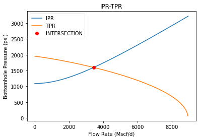

### Nodal Analysis

#### Introduction
This Python script is designed for Nodal Analysis, a crucial technique in petroleum engineering used to optimize production and estimate well performance. The code leverages equations and algorithms commonly employed in the field to calculate bottomhole pressure and Inflow Performance Relationship (IPR) for a given set of parameters.

#### Dependencies
- **numpy**: For numerical calculations.
- **matplotlib**: For plotting graphs.
- **pvtprops**: A custom library for PVT (Pressure-Volume-Temperature) properties. Details can be found [here](https://github.com/NasirliToghrul/PVTProps_Library).
- **shapely.geometry**: For geometric operations.

#### Input Parameters
The script utilizes several input parameters, including measured depth, gas properties, wellhead conditions, reservoir conditions, and fluid composition. These parameters are set as examples in the code and should be adjusted according to specific requirements.

#### Execution
The script executes a series of calculations using the provided input parameters to determine bottomhole pressure and IPR for varying flow rates. It employs equations such as the Redlich & Kwong EOS and Lee-Gonzales & Eakin correlations to model fluid behavior and flow characteristics.

#### Output
The primary output of the script is a graph illustrating the relationship between flow rate and bottomhole pressure, as well as the Inflow Performance Relationship (IPR). It identifies the intersection point between the two curves, which is crucial for understanding well performance characteristics.

#### Instructions
1. **Adjust Input Parameters:** Modify the input parameters in the script according to the specific well conditions and fluid properties.
2. **Execute the Script:** Run the script using a Python interpreter. Ensure that all dependencies are installed and accessible.
3. **Interpret Results:** Analyze the generated graph to understand the relationship between flow rate and bottomhole pressure, as well as the behavior of the Inflow Performance Relationship.

#### Additional Notes
- This script provides a basic framework for nodal analysis and can be expanded or customized to accommodate specific requirements.
- The PVTProps library is utilized for handling fluid properties. Detailed information about the library can be found on [GitHub](https://github.com/NasirliToghrul/PVTProps_Library).

## Example Graphs

## Credits

This script was developed by Toghrul Nasirli.